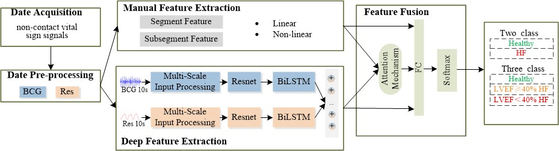

This is the official code for "Heart failure diagnosis and ejection fraction classification via feature fusion model using non-contact vital sign signals"



1.QT-pyside2: Separate non-contact vital signs signals into BCG and respiration signals.  
Open the software: Run the main file  
```python  
Step 1. Import raw individual signals collected by piezoelectric sensors  
Step 2. Click "Locate and Display"  
Step 3. Slide the window to preprocess and separate BCG and respiration signals  
Step 4. Save BCG and respiration signals  
```
2.Segmentation: Segment the signals and remove motion artifacts.  
Run MATLAB 2021a
```python  
Step 1. First run Untitled1.m  
Decompose the raw signal into segments and store them column-wise.  
Step 2. Then run Untitled2.m  
Manually remove segments with motion artifacts using the threshold method.  
Step 3. Then run Untitled3.m  
Consolidate subject data for subsequent manual and deep feature calculations.  
```
3.Manual feature extraction: Manual feature extraction on BCG and respiration signals.  
Using MATLAB 2021a
```python  
Step 1. First run main_timeFeature.m in the T1-13 folder to calculate features T1-T13.  
Step 2. Then run main_BCG_MulVolatility.m to calculate features T14-T33.  
```
4.Deep learning: Extract deep features from the signals and build a fusion classification model.  
Using PyCharm,  
Python Environment Requirements  
keras == 2.10.0  
numpy == 1.22.4  
scipy == 1.8.1  
tensorflow == 2.13.0  
xgboost == 1.6.1
```python  
Paper code execution steps:  
Step 1: Run prepareData1.py to initialize the data.  
Step 2: Run MF-XGBT.py (corresponding to MF-XGBT in Table 3 of the paper).  
Step 3: Run Resnet18.py (corresponding to Resnet18 in Table 3 of the paper).  
Step 4: Run ResnetLSTM18.py (corresponding to Resnet18-BiLSTM in Table 3 of the paper).  
Step 5: Run ResnetLSTM18_add_mulScale.py (corresponding to MS-Resnet18-BiLSTM in Table 3 of the paper).  
Step 6: Run MF+MS-Resnet18-BiLSTM+CA (MF+DF).py (corresponding to MF+MS-Resnet18-BiLSTM+CA (MF+DF) in Table 3 of the paper).  
```

